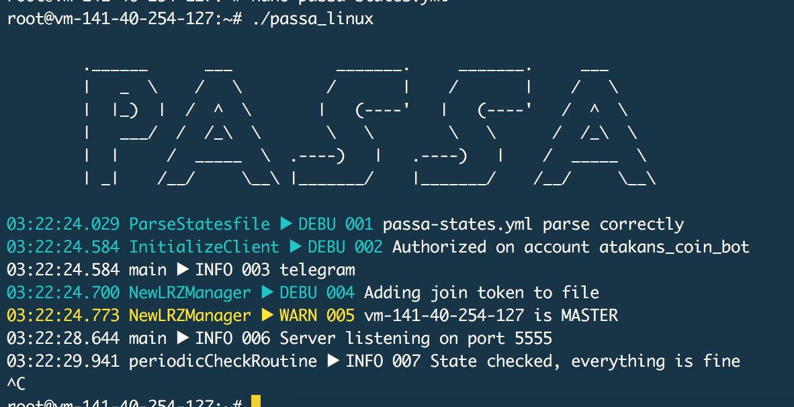

# PASSA
Predictive Auto Scaling Scheduler Application

## To Run:
`go generate`  
`go build`  
`./Passa`

or

`make run`

Use `make server` if you only want to see the server.

## Documentation:
- `godoc -http=":6060"` inside document folder.
- Click [http://localhost:6060/pkg/github.com/Cloud-Pie/PASSA/](http://localhost:6060/pkg/github.com/Cloud-Pie//PASSA/)

- Go to [this](http://localhost:6060/pkg/github.com/Cloud-Pie/PASSA/?m=all) to *see how deep the rabbit hole goes.*